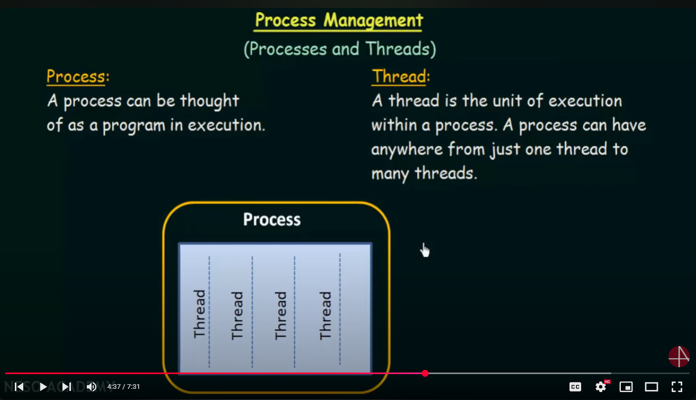
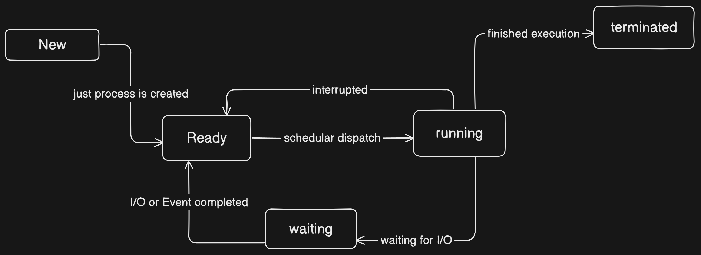

## Process and its State

### What is process?
a process can be thought of a program in execution.

So what actually happens when you make an application: 
suppose I made an application(progam) and I keep it into my hard disk, is it process? no it is not.
suppose I compile my program in order to machine  understand, is it process now? no it is not.
when I run this low level compiled program that uses some I/O, device driver or RAM is known as process.
a process can have many sub-processes.

### What is thread?
A thread is the unit of execution
within a process. A process can have
anywhere from just one thread to
many threads.

### What does it mean by process state?
The state of the program is defined by the current activity that program is doing.
a program can have multiple states but in one state at a particular instance of time.
-> Each processor may be in one of the following states:

1. New => when process is just created but not started running yet
2. Ready state => Just after process creation or After completing its waiting period. It is just before the running
3. Running state => when a program is in its execution phase
4. Waiting state => when a program is waiting for its I/O, signle etc
5. Terminated state => when a program is done its execution

